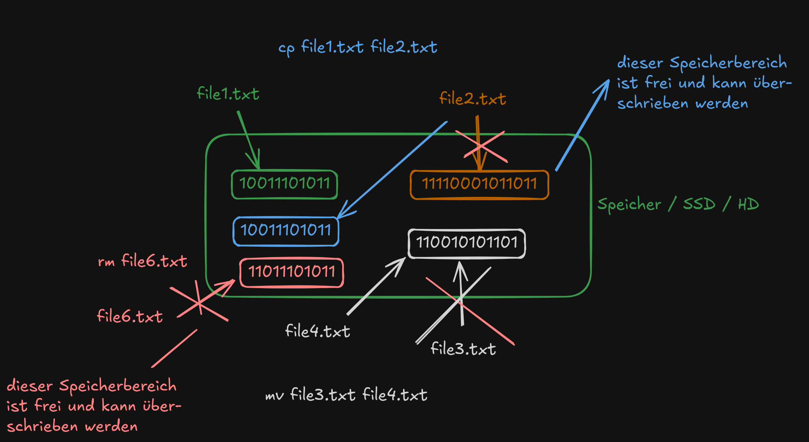
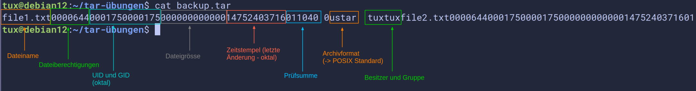
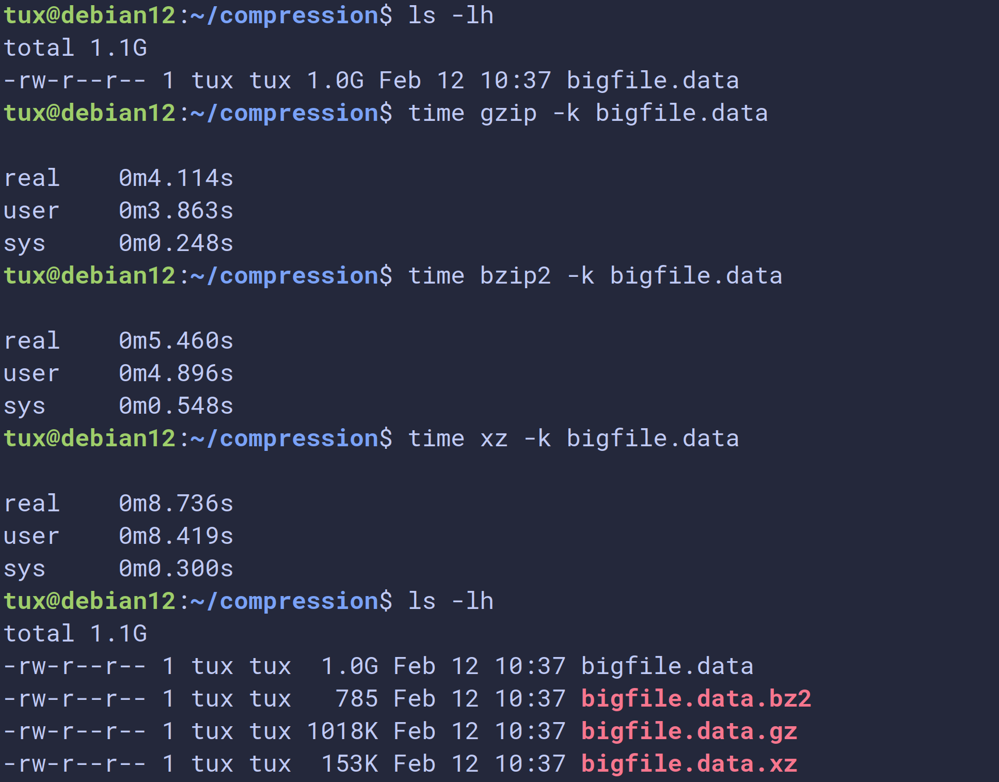
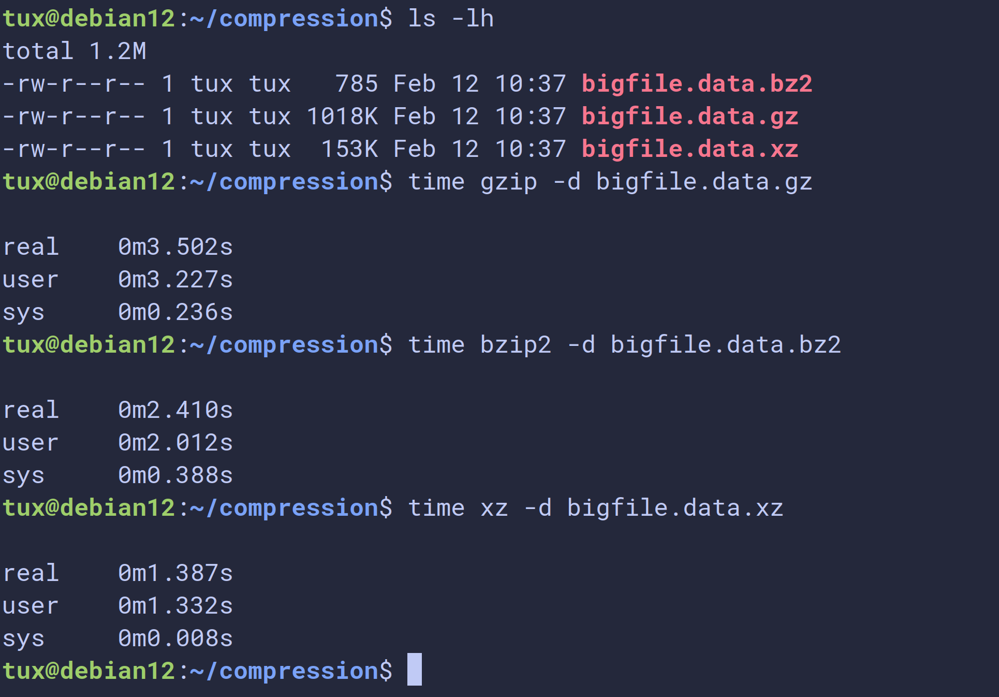

# Dokumentation Linux Essentials

## Kommandos

### Aufbau von Kommandos:
```
<kommando> [-<kurzoption>]... [<argument>]...
<kommando> [--<langoption>]... [<argument>]...
```
Erklärung zur obigen Syntax (angelehnt an Manpages):

- `[  ]` was in eckigen Klammern steht, ist **optional** -> wir können also Optionen oder Argumente übergeben, **müssen** es aber nicht
- `...` die drei Punkte bedeuten, dass auch mehrere Optionen oder Argumente übergeben werden können

>[!NOTE]
> Es macht fast immer keinen Unterschied, ob wir die Option(en) vor oder nach den Argumenten schreiben:
> ```bash
> rm -r somedir
> rm somedir -r
>```

#### Beispiele
```
ls -l               # Übergabe der Option -l
ls /etc             # Übergabe des Arguments /etc
ls -la              # Übergabe mehrerer Optionen
ls -la /etc /home   # Übergabe mehrerer Optionen und Argumente
```
### Grundlegende Kommandos

- `whoami` gibt den aktuellen Benutzer aus
- `pwd` gibt das aktuelle Verzeichnis aus
- `cat` gibt den Inhalt einer Datei auf der Kommandozeile aus
- `less` ist ein sogenannter *Pager*: gibt den Inhalt einer Datei aus, mit der Möglichkeit zu scrollen, zu suchen etc. (Benutzung siehe Manpages)
- `history` zeigt alle bisher eingegebenen Kommandos inkl. eines Indexes an (s.u.)
- `ls` zeigt den Inhalt von Verzeichnissen an
- einige Optionen von `ls`:
  - `ls -a` ignoriert keine Einträge, die mit einem Punkt beginnen -> zeigt auch "versteckte" Dateien an
  - `ls -l` zeigt ausführliche Details zu den Dateien an
- `su` *Substitue User* -> Benutzer wechseln
  - `su -l root` eine Shell mit Root-Rechten öffnen
- `exit` beendet die aktuell laufende Shell 
- `clear` *leert* die Seite, so dass unser *Prompt* sich ganz oben befindet, wir können aber auch die Tastenkombination `STRG+L` verwenden


- `init 6` -> reboot -> Erklärung später...


## Hilfe auf der Kommandozeile

### Manpages

*Manual Pages*: eine Art Handbuch zu einzelnen Kommandos, mit Erklärungen zur Syntax, allen Optionen, teilweise Beispielen etc.

- `man <kommando>` 
- z.B. `man ls` Handbuchseite zum Kommando `ls`
- Suche in den Manpages: Eingabe von `/` gefolgt vom Suchbegriff, z.B. `/-l` sucht nach der Option `-l`
- zum nächsten Suchbegriff mit `n`
- zum vorherigen Suchbegriff mit `N`
- Manpage schliessen mit `q`
- zum Anfang der Manpage springen mit `g`
- ans Ende mit `G`

### Help

*Kurzhilfe* zu einem Kommando durch Übergabe der Option `--help` -> `ls --help`

## History

Eine Liste aller bisher eingegebenen Kommandos

- Blättern durch die History mit den Pfeiltasten oder `STRG+P` bzw. `STRG+N`
* gezielt ein bestimmtes Kommando aufrufen:
- nach Eingabe von `history` Aufruf von `!<index>` -> `<index>` ist der Index des Kommandos

## SSH

Baut eine Verbindung zu einem entfernten Rechner auf bzw. startet eine Shell auf dem entfernten Rechner.
```
ssh <user>@<ip-adresse>
ssh tux@192.168.10.33
```
Um die Verbindung aufbauen zu können, brauchen wir folgende Informationen:

- IP-Adresse des entfernten Rechners
- Username und Passwort eines dort existierenden Benutzers

## Dateioperationen

### Verzeichnisse erstellen

Mit dem Kommando `mkdir` (*make directory*) können wir Verzeichnisse erstellen.
```bash
mkdir <name-des-verzeichnisses>
mkdir <pfad-zum-verzeichniss>
```
### Dateien erstellen

Dateien können auf vielfältige Art und Weise erstellt werden. Ein einfacher Weg, leere Dateien zu erstellen, ist mit dem Kommando `touch`.
```bash
touch <name-der-datei>
touch <name-der-datei-1> <name-der-datei-2> ...
touch <pfad-zur-datei>
```
Dateien können aber auch z.B. mit einem Editor wie `nano` erstellt werden.
```bash
nano <name-der>
```
### Editor nano

`nano` ist ein einfacher Editor, der auf den meisten Linux Distributionen vorinstalliert ist. Als Hilfe zur Bedienung wird unten ein Menü mit Tastenkürzeln angezeigt. Hier bedeutet das Zeichen `^` die Taste `STRG`.

Einige wichtige Tastenkombinationen:

- `STRG+O` Datei speichern unter...  (Name kann/muss angegeben werden)
- `STRG+S` Datei speichern (unter dem gleichen Namen)
- `STRG+X` Editor verlassen (bei ungespeicherten Änderungen werden wir gefragt, ob wir diese speichern möchten)

### Dateien und Verzeichnisse kopieren

Dateien und Verzeichnisse können mit dem Kommando `cp` (*copy*) kopiert werden.
```bash
cp <quelle> <ziel>
cp <pfad-zur-quelle> <pfad-zum-ziel>
```
**Vorsicht:** Wenn wir eine bestehende Datei als Ziel angeben, wird die Zieldatei **ohne Nachfrage** ersetzt und nicht etwas der Inhalt der Quelldatei an die Zieldatei angefügt.

Beim Kopieren von Verzeichnissen müssen wir an die Option `-r` (*rekursiv*) denken. 
```bash
cp -r <quellverzeichnis> <zielverzeichnis>
```
Der Grund ist, dass ein Verzeichnis nicht leer ist, die Kopieraktion also wiederholt/rekursiv ausgeführt werden muss.

### Dateien und Verzeichnisse löschen

Dateien und Verzeichnisse können mit dem Kommando `rm` (*remove*) gelöscht werden.

Analog zum Kopieren von Verzeichnissen müssen wir auch beim Löschen von Verzeichnissen die Option `-r` angeben.

> [!NOTE] 
> Dies gilt übrigens für sehr viele Kommandos: funktioniert die Anwendung eines Kommandos auf eine Datei, nicht aber auf ein Verzeichnis, so feht oft einfach nur die Option `-r`.

```bash
rm <pfad-zur-datei>
rm -r <pfad-zum-verzeichniss>
```
>[!NOTE]
> Wenn wir eine Datei löschen, so löschen wir nicht die Datei an sich. Wir entfernen lediglich den Dateinamen bzw. Pointer auf die Daten der Datei auf dem Speichermedium. Dieser Bereich im Speicher wird dann als wieder überschreibbar gemeldet.
>
> Die Daten könnten also solange keine weitere Schreiboperation auf diesen Speicherbereich erfolgt ist wiederhergestellt werden.

### Dateien und Verzeichnisse verschieben / umbenennen

Dateien und Verzeichnisse können mit dem Kommando `mv` (*move*) verschoben und umbenannt werden.

Beim Verschieben von Verzeichnissen dürfen wir die Option `-r` *nicht* angeben. Der Grund dafür ist, dass beim Verschieben nicht wie vielleicht angenommen eine Art *ausschneiden* und *einfügen* stattfindet, sondern wie beim Löschen lediglich der Dateiname ersetzt wird. 

Es muss also keine rekursive Operation auf dem Speichermedium stattfinden. Das ist auf unten stehendender Illustration vielleicht besser zu erkennen.
```bash
mv <quelle> <ziel>
mv <quellverzeichnis> <zielverzeichnis>
mv <alter-name> <neuer-name>
```
### Illustration kopieren, löschen, verschieben



### relative und absolute Pfadangaben

Immer wenn wir eine Dateioperation durchführen, müssen wir den Pfad (eine Art *Wegbeschreibung*) zu der jeweiligen Datei angeben. Diese Angabe können wir auf zwei unterschiedliche Arten und Weisen machen: *relativ* oder *absolut*.

#### relative Pfadangaben

Eine *relative Pfadangabe* beschreibt den Weg ausgehend vom **aktuellen Standort** (aktuelles Verzeichnis) im Dateisystem.
```bash
cp somefile Somedir/
```
##### spezielle Verzeichniseinträge (Special Directory Entries) . und ..

- Sie gehören zur Kategorie der relativen Pfadangaben (Relative Pathnames)
- Sie werden auch als *Pseudodirektoren* (Pseudo-Directories) bezeichnet
- Manchmal nennt man sie auch *Implizite Links* oder *Selbstreferenzierende Einträge*
- Formal sind sie aber einfach reguläre Einträge im Dateisystem, die bei jedem Verzeichnis automatisch vorhanden sind.

- `.` (Punkt) symbolisiert das aktuelle Verzeichnis
- `..` (doppelter Punkt) symbolisiert das übergeordnete Verzeichnis (Parent Directory)

#### absolute Pfadangaben

Eine *absolute Pfadangabe* beschreibt den Weg ausgehend von der Wurzel `/` (bzw. `\` in Windows) des Dateisystembaums.
```bash
cp /home/tux/somefile /home/tux/Somedir
```
Absolute Pfadangaben können wir immer daran erkennen, dass das erste Zeichen des Pfades ein Slash `/` ist.

Einzige Ausnahme ist die Tilde `~`, welche den absoluten Pfad zum Heimatverzeichnis des aufrufenden Benutzers symbolisiert. Folgende Pfadangaben sind identisch:
```bash
cd ~/Somedir
cd /home/tux/Somedir
```
### Alles ist eine Datei

"Alles ist eine Datei" ist ein zentrales Konzept in Unix/Linux, das bedeutet, dass nahezu alle Ressourcen im System – einschließlich regulärer Dateien, Verzeichnisse, Geräte, Prozesse und Sockets – über das Dateisystem als Datei abstrahiert werden. Dadurch können viele Systemkomponenten über einheitliche Schnittstellen (z. B. Dateioperationen wie `open`, `read`, `write`) angesprochen werden.

### Pattern Matching

Ein *Pattern* ist ein *Muster*, bzw. ein *Platzhalter* welches auf eine Zeichenfolge passt, so dass wir damit z.B. nach Dateien bzw. Pfadangaben suchen können (mit entsprechenden Kommandos).

Wir können in einem *Pattern* bestimmte Sonderzeichen verwenden, um dieses allgemeingültiger zu machen:

*Globbing Characters:*

- `*` (*Asterisk*) -> Steht für beliebige Zeichen, welche beliebig oft vorkommen können (auch keinmal)
- `?` -> Steht für jedes beliebige Zeichen welches, **exakt** einmal vorkommt

Weitere Möglichkeiten für Pattern Matching:

- `!(pattern)` Exkludiert das angegebene Pattern (in dem Pattern dürfen auch wieder die oben angegebenen *Globbing Characters* vorkommen

Beispiele:
```bash
rm *.jpg       # löscht alle Dateien mit der Endung .jpg
ls datei?.txt  # zeigt nur Dateien an, bei denen nach der Zeichenfolge datei noch ein weiteres beliebiges Zeichen folgt und die die Endung .txt haben
mv !(o*) ../somdir/    # verschiebt alle Dateien des aktullen Verzeichnisses nach ../somedir, ausser Dateien, die mit einem o beginnen
```
## Aliase

Aliase sind selbstdefinierte Abkürzungen für Kommandos mit Optionen. Wir verwenden Aliase z.B. für häufig verwendete Kommandos mit Optionen oder auch Argumenten wie Pfadangaben.

Das Kommando `alias` an sich zeigt alle in der aktullen Shell gültigen Aliase an.

### Definition von Aliasen
```bash
alias <name-des-aliases>='<kommando> -<option> <argument>'
alias la='ls -a'
alias rm='rm -i'
alias somedir='cd ~/path/to/specific/dir/'
```
Wenn wir Aliase einfach so auf der Kommandozeile definieren, sind diese nur in der aktullen Shell gültig. Wollen wir Aliase persistent definieren (für alle neu geöffneten Shells bzw. auch nach einem Reboot), so müssen wir die Definition in dafür vorgesehene Dateien eintragen.

Dieses Konzept gilt nicht nur für Aliase, sondern generell für die Konfiguration unseres Systems.

Aliase werden z.B. direkt in der Datei `~/.bashrc` oder besser noch in der Datei `~/.bash_aliase` definiert (wenn wir als Shell die BASH verwenden).

## Subshells

Innerhalb einer laufenden Shell können weitere Shells gestartet werden. Dies sind sogenannte *Subshell* oder *Kindshells*. Diese können entweder aktiv, z.B. durch die Eingabe des Kommandos `bash` gestartet werden, Subshells werden aber auch oft gestartet, ohne dass wir dies aktiv machen.

Es ist wichtig zu wissen, dass z.B. Aliase *nicht* in Subshells vererbt werden!

TODO

Auch beim Wechsel in einen anderen Benutzeraccount wird eine Subshell mit den Berechtigungen dieses Benutzers gestartet.

Wir können uns einen Überblick über die momentan laufenden Shells bzw. Subshells mit dem Kommando `ps` verschaffen. Mehr zu `ps` siehe [unten].

## Variablen

### Umgebungsvariablen / Environment Variables

Sind systemweit gültig, enthalten wichtige Informationen, damit unser System wie gewünscht funktioniert, bestimmte Kommandos greifen auf diese Variablen zurück. Umgebungsvariablen werden nach Konvention komplett in Grossbuchstaben geschrieben.

Einige Beispiele:
```bash
$HOME       # Heimatverzeichnis des aktuellen Benutzers
$PWD        # absoluter Pfad des aktuellen Verzeichnisses
$USER       # Login Name des aktuellen Benutzers
$SHELL      # Shell des aktuellen Benutzers

$PATH       # Liste der Verzeichnisse, die nach ausführbaren Dateien durchsucht werden, so dass wir diese ohne eine Pfadangabe aufrufen können
```
Systemvariablen können unterschiedliche Werte enthalten, je nachdem welcher Benutzer angemeldet ist. 

> [!TODO] Wo sind diese Variablen definiert?

### Shellvariablen / Shell Variables

Sind nur gültig in der aktuellen Shell, können vom Benutzer selbst definiert werden. Werden *nicht* automatisch in Subshells vererbt, es sei denn sie werden mit dem Kommando `export` exportiert.
```bash
foo=bar         # weist der Variablen foo den Wert bar zu
export foo      # macht die Variable foo auch in Subshells gültig
export hallo=huhu # weist der Variablen hallo den Wert huhu zu und macht diese in Subshells gültig
```
### Variablensubstitution

Bei der Variablensubstitution wird der Name der Variablen mit dem in ihr hinterlegten Wert ersetzt.

```bash
echo $foo       # gibt den Wert der Variablen foo aus
echo ${foo}     # gibt den Wert der Variablen foo aus
```

### Kommandosubstitution

Durch die *Kommandosubstitution* können wir Variablen die Ausgabe eines Kommandos zuweisen. Genauer gesagt wird eine *Subshell* gestartet, in welcher das Kommando ausgeführt wird.
```bash
aktuelles_datum=$(date)
aktuelles_datum=`date`     # veraltete Syntax
```
### Rechnen mir Variablen / Arithmetic Operations

Wir können auch einfache Rechenoperationen in der BASH durchführen:
```bash
zahl1=3
zahl2=4
summe=$(( zahl1 + zahl2 ))
summe=$((zahl1+zahl2))
let summe = $zahl1 + $zahl2 
```
## Escaping / Maskieren von Sonderzeichen
Bestimmte Zeichen haben eine Sonderbedeutung für die BASH. Das wohl wichtigste Sonderzeichen ist das *Leerzeichen*: 

> Das Leerzeichen ist ein Sonderzeichen. Das Leerzeichen ist das **Trennzeichen**.

Weitere Sonderzeichen sind:
```bash
*       # Asterisk
?       
#       # Kommentarzeichen
$       # Subsitution
!       # History Expansion
\       # Backslash
'
''
```
Sonderzeichen können durch das sogenannte *Escaping* oder *Maskieren* ihrer Sonderbedeutung entledigt werden, so dass sie von der Shell wie reguläre Satzzeichen behandelt werden.

Zum Maskieren gibt es drei verschiedene Wege:

1. Maskieren mit dem Backslash `\': Der Backslash maskiert (nur) das **direkt darauffolgende** Zeichen

2. Maskieren mit einfachen Hochkommata `'`: Einfache Hochkommata maskieren **jedes** in ihnen eingeschlossene Zeichen.

3. Maskieren mit doppelten Hochkommata `"`: Doppelte Hochkommata maskieren **fast** alle in ihnen eingeschlossene Zeichen, nicht aber das Dollarzeichen `$`, Backticks `\`` für die Kommandosubstitution und der Backslash `/` vor bestimmten Zeichen.

## Archivierung und Komprimierung

### Archivierung mit `tar`

*Archivierung* bezeichnet das Zusammenfassen **mehrerer** Dateien und Verzeichnisse in eine **einzige** Datei, ohne zwingende Kompression. Dadurch bleibt die ursprüngliche Struktur der Dateien erhalten, so können mehrere Dateien einfacher gespeichert oder übertragen werden.

Unter Linux wird das Kommando `tar` (*Tape Archiver*) zur Archivierung verwendet. `tar` ist ein sehr altes Programm und die Syntax (freundlich ausgedrückt) etwas gewöhnungsbedürftig. Kurzoptionen haben oft keine direkte Entsprechung zu den Langoptionen.

Ein `tar`-Archiv kann man sich mit dem Kommando `cat` anzeigen lassen:



> [!NOTE]
> Alle numerischen Angaben hier sind im *Oktalformat*. Dies hat historische Gründe. Möchte man den Zeitstempel umrechnen, kann man sich von der BASH helfen lassen:
> ```bash
> echo $(( 8#14757403716 ))
> ```

Einige wichtige Optioenen zu `tar`:
```bash
# Archiv aus Dateien erstellen
tar -cf archive.tar file1.txt file2.txt file3.txt 
tar --create --file archive.tar file1.txt file2.txt file3.txt 

# Dateien aus Archiv extrahieren
tar -xf archive.tar
tar --extract --file archive.tar

# Die Option -v / --verbose gibt eine Rückmeldung darüber, was tar macht
tar -xvf archive.tar
tar --extract --verbose --file archive.tar

# Einzelne Datei aus Archiv extrahieren
tar -xf archive.tar file_to_extract.txt

# Inhalt eines Archivs anzeigen/auflisten
tar -tf archiv.tar
tar --list --file archive.tar

# Datei einem bestehenden Archiv hinzufügen
tar -rf archive.tar other_file.txt
tar --append --file archive.tar other_file.txt

# Archiv aus einem Verzeichnis erstellen
tar -cf archive.tar /absolute/path/to/dir
tar -cf archive.tar relativ/path/to/dir

# > [!NOTE] 
# > Pfadangaben werden immer mit archiviert! Wir müssen uns also im Vorhinein Gedanken machen, ob wir z.B. einen relativen oder absoluten Pfad angeben.

# Differentielles Archiv erstellen

# Bestimmte Dateien *nicht* hinzufügen

# Archiv an einem bestimmten Ort extrahieren


--strip-components=NUMBER
```
> [!IMPORTANT]
> Die Option `-f` erfordert **zwingend** ein direkt darauffolgendes Argument - den Namen des Archivs. Insofern ist die Reihenfolge der Optionen hier **nicht** egal.

#### Unix Epoch Time

Die *Unix Epoch Time* (auch *POSIX-Zeit* oder *Unix-Zeitstempel*) ist die Anzahl der Sekunden, die seit dem 1. Januar 1970, 00:00:00 UTC vergangen sind. Sie wird oft in Betriebssystemen und Programmiersprachen verwendet, um Zeitangaben als einfache Ganzzahlen zu speichern und zu verarbeiten.

So ist es möglich, Daten in unterschiedlichen Formaten (z.B. Zeitzonen) anzugeben oder Differenzen zwischen zwei Zeitpunkten zu berechnen.

### Komprimierung

Durch die Komprimierung können wir **eine einzelne** Datei mit Hilfe bestimmter Algorithmen verlustfrei in ihrer Grösse verkleinern.

*Analogie Komprimierung:* getrocknete Handtücher, die im Wasser wieder gross werden

*Analogie Archivierung:* einzelne Blumen werden zu einem Strauss gebunden

Um **mehrere** Dateien oder ganze Verzeichnisse zu komprimieren, müssen wir zusätzlich im Vorfeld die *Archivierung* anwenden. Bestimmte Programme in Windows-Systemen vereinen diese beiden Konzepte unter einer Haube. Wir müssen uns jedoch merken, dass dies grundsätzlich zwei komplett verschiedene Konzepte sind.

Auch unter Linux ist es möglich beide Schritte auf einmal mit dem Kommando `tar` durchzuführen, dabei ruft `tar` im Hintergrund jedoch die jeweiligen Kommandos zur Komprimierung auf.

Unter Linux nutzen wir standardmässig drei verschiedene Tools zur Komprimierung: `gzip`, `bzip2` und `xz`.

Die Optionen der drei Kommandos sind mehr oder weniger identisch.
```bash
# Datei komprimieren:
gzip somefile
bzip2 somefile
xz somefile

# Datei dekomprimieren:
gzip -d somefile.gz
bzip2 -d somefile.bz2
xz -d somefile.xz

gunzip somefile.gz
bunzip2  somefile.bz2
unxz -d somefile.xz
```
>[!NOTE]
> Sowohl bei der Komprimierung als auch bei der Dekomprimierung wird die jeweilige Originaldatei nicht behalten, sondern ersetzt.
> Dies können wir mit der Option `-k` (`--keep`) umgehen.

>[!NOTE]
> Es gibt für alle drei Algorithmen auch die Option `-l` bzw.  `--list`. Hiermit können wir uns einen Überblick/Vergleich der komprimierten und unkomprimierten Datei und die Kompressionsrate anzeigen lassen.
> 
> Interessanterweise ist dies nur ein *Listing*, es findet zwar eine Dekomprimierung der Datei statt, allerdings nur im RAM, selbst wenn wir zusätzlich die Option `-d` zur Dekomprimierung angeben.

### Vergleich der drei Komprimierungsalgorithmen

Vergleich der Geschwindigkeiten und resultierenden Grössen beim Komprimieren:


Vergleich der Geschwindigkeiten beim Dekomprimieren:


Zusammenfassend lassen sich folgende Aussagen über die drei Komprimierungsalgorithmen treffen:

- `gzip` ist am schnellsten bei der Komprimierung, die komprimierte Datei ist aber nicht besonders klein
- `bzip2` braucht lange für die Komprimierung und die Dekomprimierung, erzeugt aber eine ziemlich kleine Datei
- `xz` braucht ziemlich lange bei der Komprimierung, erzeugt liegt bei der Kompressionsrate zwischen den beiden anderen, ist aber sehr schnell bei der Dekomprimierung

Es gibt also für alle drei bestimmte Anwendungsfälle, in denen sie ihre Stärken ausspielen können.

### Erstellen und Entpacken eines komprimierten Archivs direkt mit `tar`

#### Komprimiertes Archiv erzeugen
```bash
# gzip komprimiertes Archiv erstellen
tar -czf archiv.tar.gz somdir/
tar -czvf archiv.tar.gz somdir/     # verboser Output

# bzip2 komprimiertes Archiv erstellen
tar -cjf archiv.tar.bz2 somdir/
tar -czjf archiv.tar.bz2 somdir/     # verboser Output

# xz komprimiertes Archiv erstellen
tar -cJf archiv.tar.xz somdir/
tar -cJvf archiv.tar.xz somdir/     # verboser Output
```
#### Komprimiertes Archiv entpacken
```bash
# mit gzip komprimiertes Archiv entpacken
tar -xzf archiv.tar.gz
tar -xzvf archiv.tar.gz

# mit bzip2 komprimiertes Archiv entpacken
tar -xjf archiv.tar.bz2
tar -xzjf archiv.tar.bz2

# mit xz komprimiertes Archiv entpacken
tar -xJf archiv.tar.xz
tar -xJvf archiv.tar.xz

# automatisch jeweiligen Algorithmus anhand der Dateiendung anwenden lassen (Dateiendung muss stimmen!)
tar -xf archiv.tar.gz
tar -xf archiv.tar.bz2
tar -xf archiv.tar.xz
```
## Textströme und Standardkanäle

Es gibt drei Standardkanäle unter Linux:

| Kanalbezeichnung | Filedescriptor | Nummer |
| ---------------- | -------------- | ------ |
| *Standareingabekanal*  | `stdin` | 0 |
| *Standardausgabekanal*|  `stdout` | 1 |
| *Standardfehlerkanal*  | `stderr` | 2 |

Jeder Prozess der gestartet wird, wird mit diesen drei Standardkanälen verbunden. Über diese Kanäle erhält der Prozess Daten und gibt sie auch wieder aus. So können Ein- und Ausgaben unabhängig voneinander verarbeitet und auch umgeleitet werden.

Die Kanäle jedes Prozesses, der in einer Shell gestartet wird, sind automatisch mit der Shell verbunden.

Durch dieses Konzept können wir durch die Kombination simpler Kommandos komplexe Aufaben lösen (-> *Kommandopipelines*) 

Wir könne so z.B. auch Ausgaben von Kommandos in Dateien umleiten (-> *Redirects*).

### Redirects

Mit Redirects kann die der Standardausgabekanal oder der Standardfehlerkanal in eine **Datei** umgeleitet werden. Es gibt zwei Arten von Redirects:

- `>` - einfacher Redirect: Erstellt eine Datei falls nicht vorhanden, **leert** eine bereits vorhandene Datei
- `>>` - doppelter Redirect: Erstellt eine Datei falls nicht vorhanden, **hängt Ausgabe an**

#### Umleitung des Standareingabekanals
```bash
echo huhu 1> hallo.txt   # die 1 gibt hier die Kanalnummer an
echo huhu 1>> hallo.txt  # die 1 gibt hier die Kanalnummer an
echo huhu > hallo.txt    # kann bei stdout auch weggelassen werden

ls -l /etc > ls-ausgabe.txt
ls -l /etc >> ls-ausgabe.txt
```
#### Umleitung des Standardfehlerkanals
```bash
ls mich-gibts-nicht  2> ls-fehler.txt     # hier muss die 2 stehen, da wir stderr umleiten
ls mich-gibts-nicht  2>> ls-fehler.txt    # hier muss die 2 stehen, da wir stderr umleiten
```
#### Umleitung beider Kanäle
```bash
# in separate Dateien
ls mich-gibts/ mich-gibts-nicht/ > ergebnis.txt 2>fehler.txt

# in die gleiche Datei
ls mich-gibts/ mich-gibts-nicht/ > ausgabe-und-fehler.txt 2>&1
```
>[!NOTE]
> Das `&` gibt hier an, dass wir einen *Kanal*/*Filedescriptor* meinen, ansonsten würden die Fehler in eine Datei mit dem Namen `1` umgeleitet werden.


